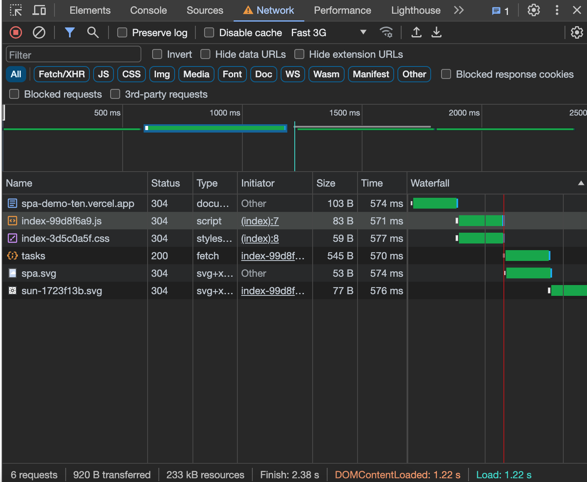
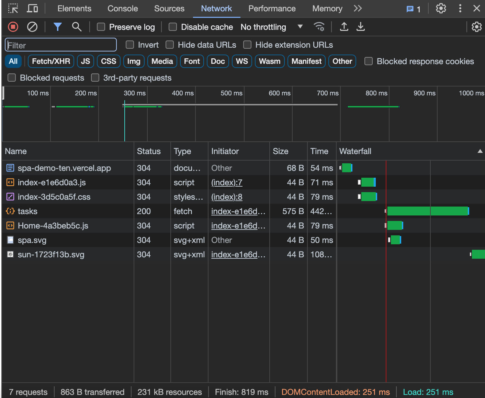
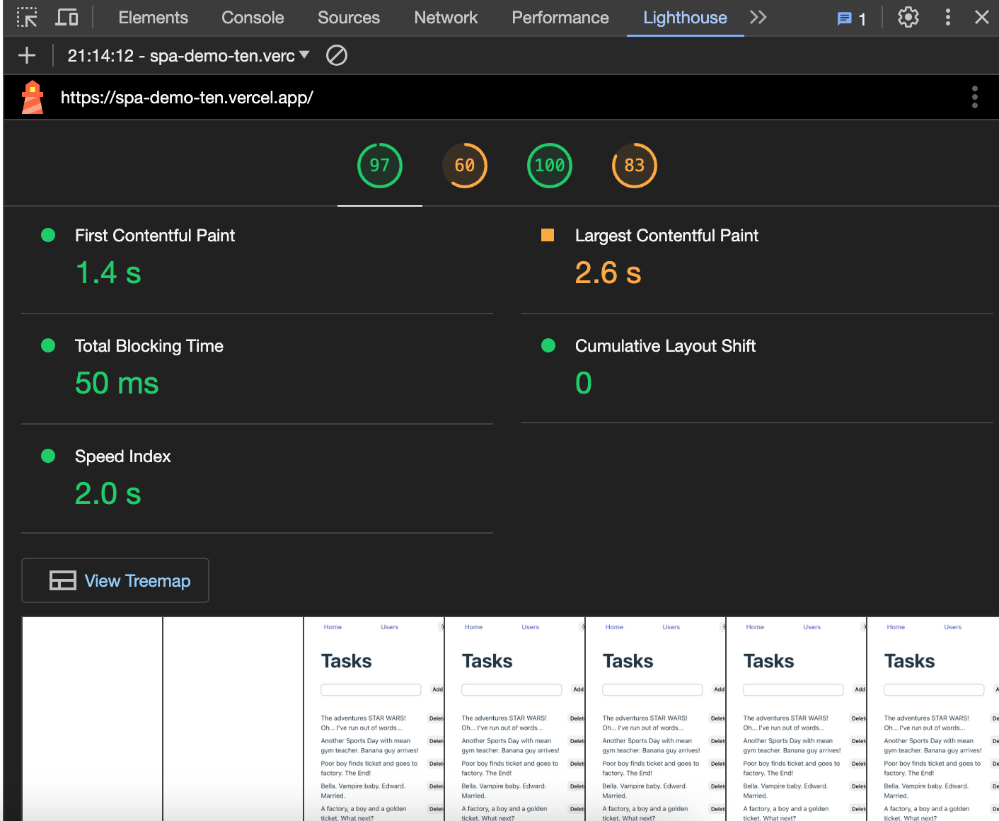
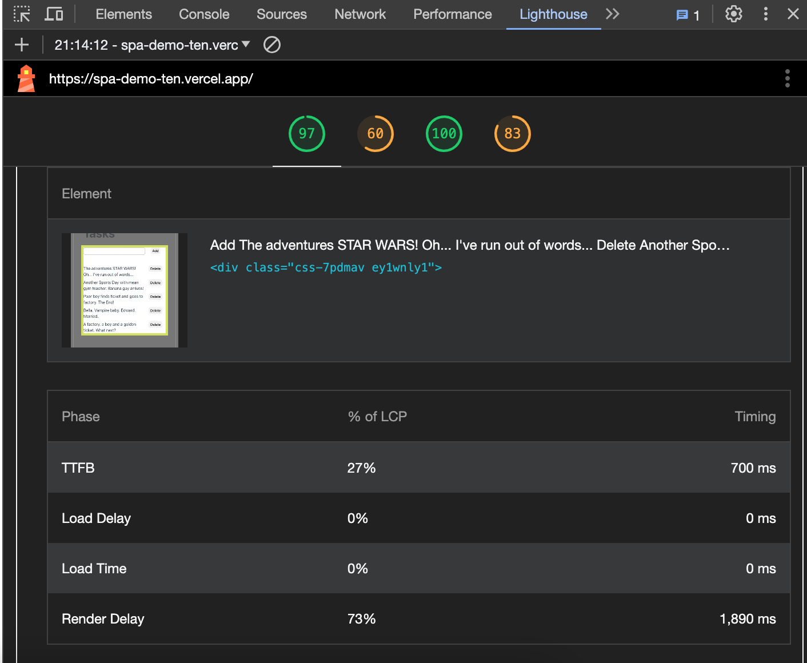
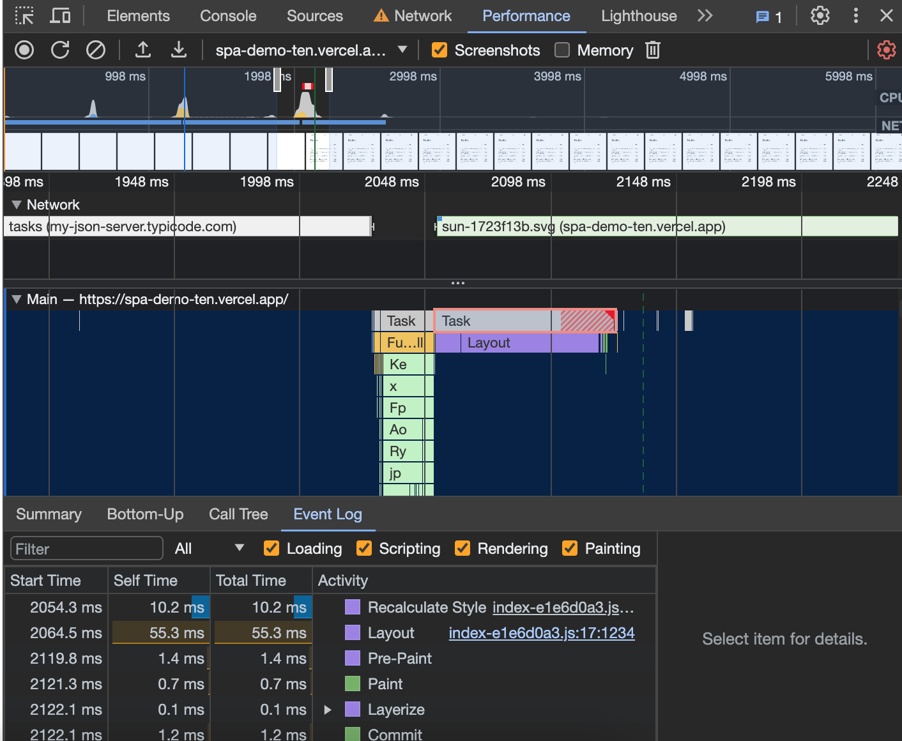

# SPA Demo

A demo for single page application.

## Getting Start

Local development

```sh
   npm install
   npm run dev
```

Production (Deployed by Vercel)

https://spa-demo-ten.vercel.app/

## Tech Explanation

| Feature                                                  |     |
| -------------------------------------------------------- | --- |
| Home page showcases dynamic content fetched from API     | ✅  |
| Home page users can add, delete and list items           | ✅  |
| User list page displays a list of users                  | ✅  |
| User list pagination: limit to 10 users per page         | ✅  |
| User list provide sorting options for name and age       | ✅  |
| User list includes a search bar to search users by name  | ✅  |
| User detail page displays detailed information of a user | ✅  |
| User detail page provides back button to user list page  | ✅  |
| Theme switcher (light/dark mode) by Emotion              | ✅  |
| Code-splitting by react-router v6 lazy import            | ✅  |

### Data resource

Powered by JSONPlaceHolder.

Resource https://github.com/lucent1090/spa-demo-db

### Code Quality

To decouple data loading and rendering logic, all pages come with a data loader. Please refer to `router.tsx` for more detail.

```jsx
const router = createBrowserRouter([
{
   index: true,
   ...
   loader: homeLoader,
},
...])
```

### Performance

For better code-splitting, all routes are lazy loading. Please refer to `router.tsx` for more detail.

```jsx
const router = createBrowserRouter([
{
   index: true,
   lazy: async () => {
      const UserComp = await import("./page/Users");
      return { Component: UserComp.default };
   },...
},
...])
```

| Before                             | After                          |
| ---------------------------------- | ------------------------------ |
|  |  |

After adding lazy loading, the bundle splits from one big `index.js` with 84B to `index.js + Home.js` 44B. (Network time might not worth to consider due to different network situation)

### Future Performance Improvement

When taking a look at lighthouse , it indicates that LCP could be improved. The biggest element is the task list. Detail shows that TTFB is well-controlled by only 27% but render delay tooks place by 73%. According to the [standards](https://web.dev/articles/optimize-lcp?hl=en#optimal_sub-part_times), it would be the better to cut down to 10%.





From the performance break down, it's clear that there's a heavy task working on and perform recalculate of layout. This could be a place to dive in and check for the improvement opportunity. For example, moving to SSR rendering or using server component.


